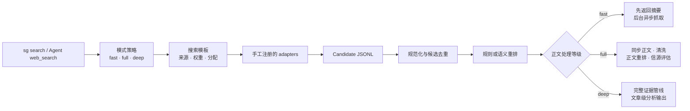

# 聚合搜索 / Search Governor

[](https://github.com/wet86y/search-governor/actions/workflows/ci.yml)
[](https://www.python.org/)
[](integrations/openclaw/README.md)
[](LICENSE)

如果你手头上有若干个搜索订阅服务，想尽可能利用上，可以尝试聚合搜索。通过多源搜索、统一去重并排序，获取更高质量的搜索结果；同时，强化的正文抓取与清洗能尽可能减少网页噪声干扰。

Search Governor 不是新的搜索内容供应商，而是位于多个搜索来源之上的治理层。你可以把已有的 Agent web search、搜索 Skill、API、脚本、知识库、浏览器流程或平台爬虫包装成 adapter，交给同一个入口统一调度。

```text
一个搜索入口 + 多个自有来源 + 一条可审计治理管线
```

## 它能做什么

- **充分利用已有订阅**：把不同服务放进同一个手工注册表，不必在多个工具之间反复切换。
- **统一候选结果**：所有 adapter 输出同一种 Candidate JSONL，供应商差异不会泄漏到上层工作流。
- **搜索结果去重**：规范化 URL，并合并相同 URL 或高度相似标题的候选结果。
- **预算化多源搜索**：搜索模式决定总预算，搜索模板决定供应商集合、权重和预算分配。
- **规则或模型重排**：无模型时仍可规则排序；配置兼容模型后可进行语义重排、正文重排和信源评估。
- **强化正文处理**：依次尝试供应商内联正文、原生抓取、直接 HTTP，以及受控的浏览器回退。
- **降低网页噪声**：清理导航、脚本、样式及重复行等干扰内容，为后续阅读和分析保留更干净的正文。
- **保留运行证据**：候选、去重、排序、抓取状态、模型报告和最终输出均可写入独立 run 目录。
- **接入 Agent**：项目包含 Agent 插件注册层；目前已实现并验证 OpenClaw，其他 Agent 可按相同契约扩展。

> 当前去重分为候选 URL/相似标题去重，以及单篇正文内部的重复行清理。跨文档正文指纹去重尚未实现。

## 三档搜索模式

模式不是简单的“搜索更多或更少”，而是对应三种不同的工作方式。

| 模式 | 适用情况 | 默认行为 |
|---|---|---|
| `fast` | 普通网页查询、快速事实核对、只需要少量链接 | 总搜索预算 15，返回 5 条；先完成多源搜索、去重和排序，再异步抓取可展开结果的正文，Agent 可通过 status/read 稍后读取清洗后的内容 |
| `full` | 要求全面、多来源、对比、全文或证据导向的检索 | 总搜索预算 40，默认返回 8 条；同步扩展正文、清洗内容、执行正文重排，并在模型可用时评估信源质量 |
| `deep` | 明确要求深度研究、研究报告或带来源的证据文章 | 包含完整的 full 管线，再根据 point question、goal、boundaries、output use 四项研究简报生成文章级输出 |

`deep` 缺少分析模型时默认报告能力缺失，不会悄悄伪装成完整研究。只有用户明确允许时，才会降级为带醒目标记的确定性证据提纲。

## 工作原理



对外只有一个搜索入口：CLI 使用 `sg search`，Agent 使用注册后的同一个 Search Governor 搜索工具。`search_governor_status` 与 `search_governor_read` 只是 fast 搜索后的正文状态和读取接口，不是第二个搜索入口。

## 供应商 adapter 契约

每个来源都由 manifest 和子进程 adapter 构成：

1. Search Governor 向 adapter 的 stdin 写入一个请求 JSON。
2. adapter 向 stdout 输出一行一个 Candidate JSON。
3. stderr 只用于诊断信息和 `SG_REPORT_JSON=` 结构化执行报告。
4. Candidate 至少包含 `title` 和 `url`，还可提供 `snippet`、`provider`、`rank`、`published_at`、`language`、`content_kind`、`raw_score` 与 `extra`。

完整规范见 [Provider Adapter Contract](docs/PROVIDER_ADAPTER_CONTRACT.md)。Search Governor 只运行中央注册表明确启用的来源，不会自动扫描和执行陌生目录，也禁止把自身注册为内部来源造成递归。

## 正文抓取与清洗

正文获取遵循明确的回退顺序：

1. 优先使用供应商声明的内联正文或 native fetch。
2. 对允许外部抓取的结果使用 Search Governor 直接 HTTP。
3. 只有 `blocked`、`rate_limited`、`empty` 等声明允许的失败类型才进入浏览器回退。
4. DNS 失败、连接拒绝、重置或普通超时不会盲目启动浏览器。
5. 正文经过 HTML 提取、噪声过滤、长度控制和重复行清理后写入缓存。

fast 默认采用 summary-first：搜索结果可以先交给 Agent，正文抓取在独立后台进程中继续。调用方可通过 run ID、结果序号、cache key 或 URL 查询状态并读取清洗后的正文。

## 快速开始

正式支持 Python 3.12、Linux 和 WSL。原生 Windows 与 macOS 尚未认证。

```bash
mkdir -p ~/projects
git clone https://github.com/wet86y/search-governor.git ~/projects/search-governor
cd ~/projects/search-governor
bash scripts/install.sh
sg health
```

安装脚本从已提交的 Git tree 生成不可变 release，在 release 内建立虚拟环境，并创建稳定的 `~/.local/bin/sg` 包装器。开发仓库不会直接充当生产运行目录。

项目不附带真实搜索供应商。公开仓库仅提供不会被生产环境自动扫描的 mock adapter，用于验证协议：

```bash
SG_SOURCES_DIR=examples/managed_sources \
  sg search "contract test" \
  --providers mock \
  --allow-disabled-sources \
  --allow-rule-fallback \
  --no-fetch \
  --format json
```

## 注册自己的搜索来源

1. 在 `~/.local/share/search-governor/runtime/managed_sources/<provider-id>/` 放置 `source.json` 与 adapter。
2. 在唯一的 `runtime/managed_sources/sources.json` 中登记 ID、manifest 路径和启用状态。
3. 在 `runtime/config/provider_presets.local.json` 中配置本地模板与权重。
4. 运行 `sg health`，确认入口、依赖、环境变量和能力声明一致。

```json
{
  "sources": [
    {
      "id": "my_search",
      "path": "my_search/source.json",
      "enabled": true
    }
  ]
}
```

然后通过同一个入口选择模式：

```bash
sg search "query" --mode fast
sg search "query" --mode full
sg search "query" --mode deep \
  --point-question "What must be answered?" \
  --goal "Why this search is needed" \
  --boundaries "Scope constraints" \
  --output-use "How the evidence will be used"
```

## OpenClaw 集成

OpenClaw 是当前唯一完成实现和生产验证的 Agent 集成。插件注册：

- `web_search` provider：`search-governor`
- 正文状态工具：`search_governor_status`
- 正文读取工具：`search_governor_read`

普通快速查询走插件暴露的 fast；full/deep 由完整 Agent Skill 根据用户意图调用同一个 `sg search`。插件不会覆盖 OpenClaw 原生 `web_fetch`。

```bash
openclaw plugins install --link \
  ~/.local/share/search-governor/current/integrations/openclaw --force

python3 ~/.local/share/search-governor/current/scripts/build_openclaw_skill.py \
  --root ~/.local/share/search-governor/current \
  --runtime-root ~/.local/share/search-governor/runtime \
  --sg-bin ~/.local/bin/sg
```

完整安装和 Skill 路由说明见 [OpenClaw Integration](integrations/openclaw/README.md)。架构允许继续实现其他 Agent integration，但 v0.1.1 尚未声称这些插件已经过验证。

## 开发与运行目录

```text
~/projects/search-governor/                     Git 开发仓库

~/.local/share/search-governor/                 稳定安装与运行资产
  releases/<version>-<commit>/                  Git tree 生成的不可变发行快照
  current -> releases/<version>-<commit>/       当前发行指针
  runtime/
    config/                                     本地配置与密钥
    managed_sources/                            真实供应商注册表和 adapters
    connectors/                                 私有平台连接器
    integrations/openclaw/local/                本地 Agent 路由扩展
    data/                                       缓存、日志、run 与 staging
  backups/                                      本地回滚资料
  install-state.json                            当前安装记录

~/.local/bin/sg                                 稳定 CLI 包装器
```

`SG_APP_HOME` 指向不可变代码，`SG_RUNTIME_HOME` 指向可变运行资产；`SG_HOME` 仅作为旧调用方兼容的 runtime 别名。`.env`、真实 adapter、Cookie、浏览器 profile、运行记录、缓存及平台爬虫数据不会进入 Git 或源码发行包。

## 项目状态

| 能力 | v0.1.1 |
|---|---|
| CLI 与统一 adapter 协议 | 已支持 |
| 手工供应商注册与健康检查 | 已支持 |
| fast / full / deep | 已支持 |
| fast 异步正文抓取与读取 | 已支持 |
| 规则排序与兼容模型重排 | 已支持 |
| OpenClaw 插件与 Agent Skill | 已支持并验证 |
| 其他 Agent 插件 | 架构可扩展，尚未验证 |
| 跨文档正文指纹去重 | 尚未实现 |

## 安全与发布边界

- 公开 release 必须从 Git tree 生成，禁止直接压缩本地部署目录。
- 未注册目录不参与搜索；重复 ID、未知模板来源和缺失依赖会明确报错。
- adapter 诊断、Cookie 和本地凭据不得成为搜索结果内容。
- CAPTCHA、强制登录和反爬验证以 `auth_required` 明确返回，不静默切换搜索来源。

## License

[Apache License 2.0](LICENSE)。真实供应商 adapter 与本地平台连接器不属于公开发行内容。
