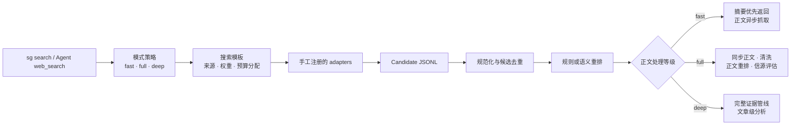

# 聚合搜索 / Search Governor

[](https://github.com/wet86y/search-governor/actions/workflows/ci.yml)
[](https://www.python.org/)
[](integrations/openclaw/README.md)
[](LICENSE)

如果你已经订阅了多个搜索服务，并希望充分利用这些资源，可以尝试聚合搜索。它通过多源检索、统一去重与排序，提升结果的覆盖度和质量；同时借助强化的正文抓取与清洗流程，尽可能降低网页噪声对后续阅读和分析的干扰。

Search Governor 是一个与搜索供应商解耦的搜索治理引擎。它不提供搜索内容，而是将现有的 Agent web search、搜索 Skill、API、脚本、知识库、浏览器流程或平台爬虫接入同一条处理管线，并通过唯一的搜索入口统一调度。

## 核心能力

- **聚合既有搜索资源**：通过手工注册的 adapter 统一管理不同订阅服务和本地来源。
- **规范化与去重**：统一候选数据结构，规范化 URL，并合并 URL 相同或标题高度相似的结果。
- **预算化检索**：由搜索模式确定总预算和处理等级，由搜索模板确定来源、权重及预算分配。
- **可选模型增强**：无模型时使用规则排序；配置兼容模型后，可启用语义重排、正文重排和信源质量评估。
- **正文获取与清洗**：支持内联正文、原生抓取、直接 HTTP 和受控浏览器回退，并清理常见页面噪声及正文重复行。
- **可审计运行记录**：保存候选、去重、排序、抓取状态、模型报告和最终输出，便于复核与排错。
- **Agent 集成**：提供通用集成契约；当前已实现并验证 OpenClaw 插件与 Agent Skill。


## 搜索模式

三档模式分别面向快速查询、完整检索和深度研究，差异不仅在于结果数量，也包括正文处理与分析等级。

| 模式 | 适用场景 | 默认策略 |
|---|---|---|
| `fast` | 普通网页查询、快速事实核对、获取少量参考链接 | 总搜索预算 15，返回 5 条；完成多源检索、去重和排序后优先返回摘要，并在后台异步抓取可展开结果的正文 |
| `full` | 全面检索、多来源对比、全文阅读或证据整理 | 总搜索预算 40，默认返回 8 条；同步获取并清洗正文，执行正文重排，并在模型可用时评估信源质量 |
| `deep` | 深度研究、研究报告或带来源的证据文章 | 执行完整的 `full` 管线，并依据研究问题、目标、边界和输出用途生成文章级分析结果 |

`deep` 需要可用的分析模型。能力缺失时，Search Governor 默认明确报错；只有在调用方显式允许后，才会降级为带标记的确定性证据提纲。

## 处理流程



CLI 使用 `sg search`，Agent 使用注册后的 Search Governor 搜索工具。OpenClaw 集成提供的 `search_governor_status` 和 `search_governor_read` 仅用于查询 fast 正文状态和读取缓存内容，不构成额外的搜索入口。

## Adapter 协议

每个来源由 manifest 和子进程 adapter 组成：

1. Search Governor 向 adapter 的 stdin 写入一个请求 JSON。
2. adapter 向 stdout 输出 Candidate JSONL。
3. stderr 仅用于诊断信息及 `SG_REPORT_JSON=` 结构化执行报告。
4. Candidate 至少包含 `title` 和 `url`，也可提供 `snippet`、`provider`、`rank`、`published_at`、`language`、`content_kind`、`raw_score` 和 `extra`。

Search Governor 只执行中央注册表中明确启用的来源，不自动扫描陌生目录；重复 ID、未知模板来源、缺失依赖和递归注册都会被明确拒绝。完整规范见 [Provider Adapter Contract](docs/PROVIDER_ADAPTER_CONTRACT.md)。

搜索模板或显式请求选中的 Provider 会全部并发执行，不再设置独立的并发预算。Provider 报告仍按请求中的来源顺序输出，每个 Adapter 的独立超时语义保持不变。

## 正文处理

正文获取遵循固定的回退顺序：

1. 使用供应商声明的内联正文或 native fetch。
2. 对允许外部抓取的 URL 执行直接 HTTP 请求。
3. 仅在 `blocked`、`rate_limited` 或 `empty` 等允许的失败类型下调用浏览器回退。
4. 对获取到的正文执行 HTML 提取、噪声过滤、长度控制和重复行清理，并写入缓存。

DNS 失败、连接拒绝、连接重置或普通超时不会触发浏览器回退。验证码、反爬验证和强制登录以 `auth_required` 返回，由调用方决定是否完成验证后重试。

直接 HTTP 和浏览器回退都会拒绝本机、私有、链路本地、保留、组播及未指定地址；域名的全部 DNS 解析结果和直接 HTTP 的每次重定向目标均须通过同一安全检查。安全拒绝记录为 `blocked` / `unsafe_url`，不会触发浏览器回退。

## 安装

项目正式支持 Python 3.12、Linux 和 WSL。原生 Windows 与 macOS 尚未认证。

```bash
mkdir -p ~/projects
git clone https://github.com/wet86y/search-governor.git ~/projects/search-governor
cd ~/projects/search-governor
bash scripts/install.sh
sg health
```

安装脚本从已提交的 Git tree 生成不可变 release，并安装稳定的 `~/.local/bin/sg` 包装器。项目当前没有第三方运行时依赖，release 直接使用 WSL 的系统 Python 3.12，不再为每个版本复制虚拟环境。开发仓库与可变运行资产相互独立。

公开仓库不附带真实搜索供应商，只提供不会被生产环境自动扫描的 mock adapter，用于验证协议：

```bash
SG_SOURCES_DIR=examples/managed_sources \
  sg search "contract test" \
  --providers mock \
  --allow-disabled-sources \
  --allow-rule-fallback \
  --no-fetch \
  --format json
```

## 注册搜索来源

1. 在 `~/.local/share/search-governor/runtime/managed_sources/<provider-id>/` 放置 `source.json` 和 adapter。
2. 在 `runtime/managed_sources/sources.json` 中登记 ID、manifest 路径和启用状态。
3. 在 `runtime/config/provider_presets.local.json` 中配置本地搜索模板与权重。
4. 运行 `sg health`，检查入口、依赖、环境变量和能力声明。

```json
{
  "sources": [
    {
      "id": "my_search",
      "path": "my_search/source.json",
      "enabled": true
    }
  ]
}
```

## 使用

```bash
sg search "query" --mode fast
sg search "query" --mode full
sg search "query" --mode deep \
  --point-question "What must be answered?" \
  --goal "Why this search is needed" \
  --boundaries "Scope constraints" \
  --output-use "How the evidence will be used"
```

fast 在没有模型配置时仍可使用规则排序。语义重排、信源评估和 deep 分析通过本地配置及兼容模型端点启用，公开配置不绑定具体模型厂商。

## OpenClaw 集成

OpenClaw 是当前唯一完成实现和验证的 Agent 集成。插件注册一个 `web_search` provider `search-governor`，以及 fast 正文的状态和读取工具；完整 Agent Skill 负责根据用户意图路由 full 和 deep 请求。集成不会覆盖 OpenClaw 原生 `web_fetch`。

```bash
openclaw plugins install --link \
  ~/.local/share/search-governor/current/integrations/openclaw --force

python3 ~/.local/share/search-governor/current/scripts/build_openclaw_skill.py \
  --root ~/.local/share/search-governor/current \
  --runtime-root ~/.local/share/search-governor/runtime \
  --sg-bin ~/.local/bin/sg
```

插件只需通过上述稳定 `current` 路径注册一次。后续本地发布切换 `current` 后，重启并验证 OpenClaw Gateway 已加载新版本即可，不需要重新注册插件，也不要把公开插件代码复制到 `runtime`。

安装与路由说明见 [OpenClaw Integration](integrations/openclaw/README.md)。其他 Agent 可以基于同一 integration contract 扩展，但 v0.1.3 尚未提供经过验证的实现。

完成开发并提交后，可用一个本地命令完成检查、发布和 OpenClaw 切换：

```bash
python3 scripts/publish_local_release.py --source-root "$PWD"
```

该脚本要求工作树干净，从已提交的 `HEAD` 运行完整检查并构建 release；未提交内容不会进入发行版。它会验证系统 Python 3.12 和依赖声明，应用 `runtime/integrations/openclaw/local/skill-routes.md` 私有扩展来生成并原子部署 Skill，更新 `current`，只保留当前与上一个本地 release，重启 Gateway，并确认稳定 CLI 与插件加载成功。脚本不会创建 tag、推送提交或调用 GitHub。

## 源码同步与发布边界

本项目与 Personal KB Toolkit 采用相同的发布边界：本地运行版本与 GitHub 源码同步是两条独立流程。

- 本地发布使用上述脚本，从 committed `HEAD` 构建版本化 release，并管理 `current` 与回滚版本。
- GitHub 只同步 `main` 分支的源码提交；推送前运行 `bash scripts/check.sh`，然后执行 `git push origin main`。
- 不创建或推送版本 tag，不创建 GitHub Release，也不上传 ZIP、构建产物或其他 Release assets。
- GitHub 自动提供的仓库源码下载能力已经足够；CI 工作流只验证源码，不承担发布职责。

项目版本号用于代码兼容性和本地 release 标识，不代表必须存在对应的 GitHub Release 或 tag。

## 本地目录

```text
~/projects/search-governor/                     Git 开发仓库

~/.local/share/search-governor/                 稳定安装与运行资产
  releases/<version>-<commit>/                  不可变发行快照
  current -> releases/<version>-<commit>/       当前发行指针
  runtime/
    config/                                     本地配置与密钥
    managed_sources/                            真实供应商注册表和 adapters
    connectors/                                 私有平台连接器
    integrations/openclaw/local/                本地 Agent 路由扩展
    data/                                       缓存、日志、运行记录与生成暂存区
  backups/                                      本地回滚资料
  install-state.json                            当前安装记录

~/.local/bin/sg                                 稳定 CLI 包装器
```

`SG_APP_HOME` 指向不可变代码，`SG_RUNTIME_HOME` 指向可变运行资产；`SG_HOME` 仅作为旧调用方兼容的 runtime 别名。

每次本地部署会保留当前 release 与切换前的上一个 release，并删除更旧的本地快照；被清理版本仍可由 Git 提交重新生成。

本地密钥、真实 adapter、Cookie、浏览器 profile、运行记录、缓存和平台爬虫数据不会进入 Git 或源码发行包。公开发行内容必须从 Git tree 生成，禁止直接打包本地部署目录。

## License

[Apache License 2.0](LICENSE)。真实供应商 adapter 与本地平台连接器不属于公开发行内容。
